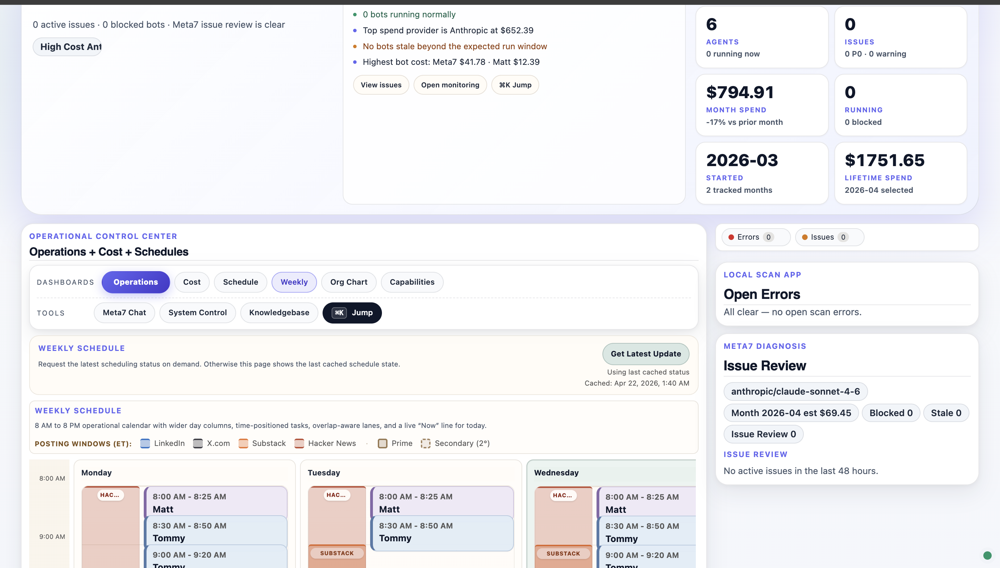
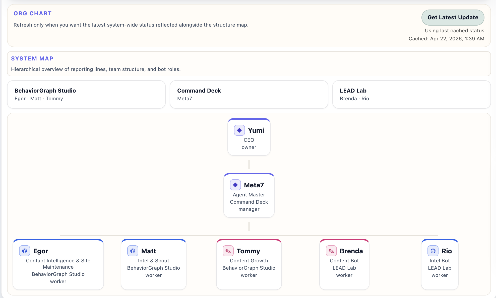

# Multi-Agent AI System: Code Samples

Selected code samples from a multi-agent orchestration platform I built to run real marketing operations for my enterprise AI startup. The system coordinates 6 specialized AI agents that handle daily intelligence gathering, content creation, and operational monitoring. This is production software doing real work, not a research prototype.

I built the dashboard app to supervise my agents running on [OpenClaw](https://github.com/anthropics/openclaw) — tracking their performance, managing costs across LLM providers, and monitoring workflows without constantly watching logs. I'm also a contributor to the OpenClaw project itself ([#42974](https://github.com/openclaw/openclaw/issues/42974)).

16,000+ lines of Python/JavaScript. Zero external dependencies.

## Screenshots

### Operational Dashboard


Real-time agent status, weekly schedule calendar with time-positioned tasks, LLM cost tracking across providers, and scan app health monitoring. Built with vanilla JavaScript, no frameworks.

### Agent Org Chart


Hierarchical view of the agent team. A manager agent coordinates 5 worker agents across two product teams. Each agent has a defined role, model assignment, and reporting structure.

## Architecture

```
Dashboard (JS/CSS)
  Weekly calendar, org chart, cost tracking, chat

Orchestration Server (Python)
  Agent scheduling, scan pipelines, watchdogs

Scanners
  LinkedIn | X | HN/Reddit | Substack | Events

Knowledge Base (Markdown + JSON)
  Wiki, evidence log, qualification pipeline, schemas
```

## What's in Each Folder

**`agent-orchestration/`** Scheduling engine that manages 6 AI agents with conflict-free time slots, stall detection, and graceful shutdown. Includes a subprocess wrapper with dual kill rules (absolute timeout + CSV-stall detection) that nudges agents to save partial work before force-killing.

**`knowledge-base/`** Markdown-first knowledge base with formal ingest, qualification, and promotion pipelines. Designed so both humans and LLMs can maintain it. Layered architecture: immutable sources, raw intake buffer, maintained wiki, durable outputs. Every incoming signal is explicitly accepted, rejected, or deferred with an audit trail.

**`dashboard-visualization/`** Single-page dashboard that visualizes agent activity, costs, and schedules. Weekly calendar with overlap-aware lane assignment and a live "Now" line. Tracks LLM token usage across OpenAI, Anthropic, and Google with monthly ledgers.

**`scan-pipeline/`** Cross-platform intelligence gathering with AI-powered quality filtering. Unified pipeline that normalizes data from LinkedIn, X, HN/Reddit, and Substack into a common schema. Uses Gemini for relevance filtering. Chrome automation with profile management and anti-throttling.

## Technical Choices

- Zero external dependencies (Python standard library only)
- Markdown-first knowledge base (diff-friendly, works for human and LLM consumption)
- File-based state (JSON instead of database, simple and inspectable)
- macOS-native integrations (AppleScript for email and browser automation)

## Context

I built this system to run real marketing operations for my enterprise AI startup. The agents scan LinkedIn, X, HN/Reddit, and Substack daily for market intelligence, generate content, and manage publishing workflows. The dashboard gives me visibility into agent performance, LLM costs, and scheduling so I can supervise the system efficiently.

The knowledge base grew from a practical need: as agents collected hundreds of signals per week, I needed a structured way to qualify, promote, and maintain durable knowledge that both humans and AI could rely on. The design reflects ideas from my published research ("The Organizational Intelligence Loop") on how enterprise AI systems can maintain auditable organizational knowledge.
